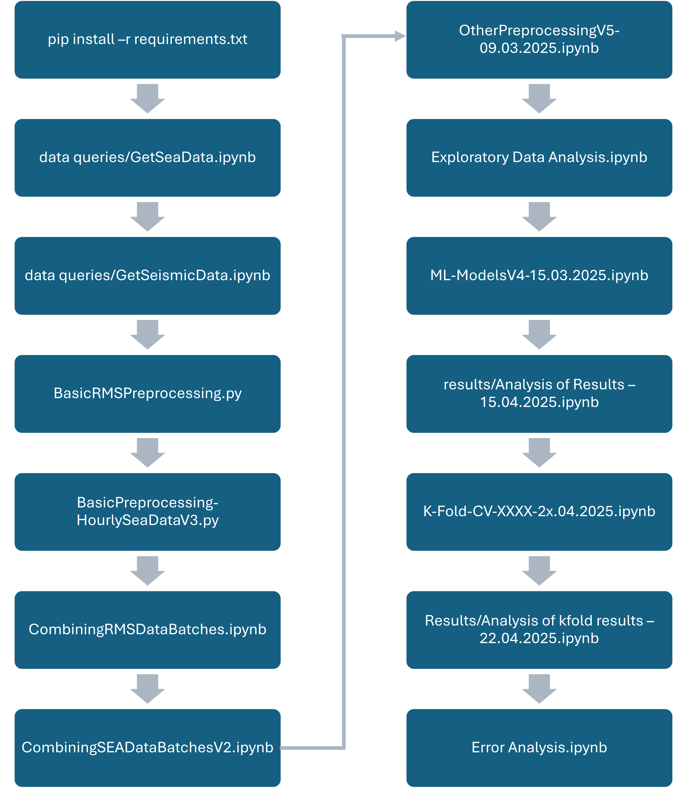

## Enhancing Ocean Monitoring for Coastal Communities Using AI

This repository contains the code and sample data that corresponds to the paper called "Enhancing Ocean Monitoring for Coastal Communities Using AI" submitted to 'Conservation'. This project explores the relationship between seismic ground movements and the sea significant wave height.

## Getting Started

### Prerequisites
Install the required dependencies with:

```bash
pip install -r requirements.txt
```

### Running The Code
Follow the order of script execution as outlined in the flowchart below:



Each script includes inline comments for guidance.

### Sample Data

Due to file size upload limitations, only a sample of the dataset is included in this repository for the preprocessing stage.

The dataset for each station, saved under 'Processed Data/15.03.2025 Data/' is complete, and as such, the code training ML models can be executed in full.

